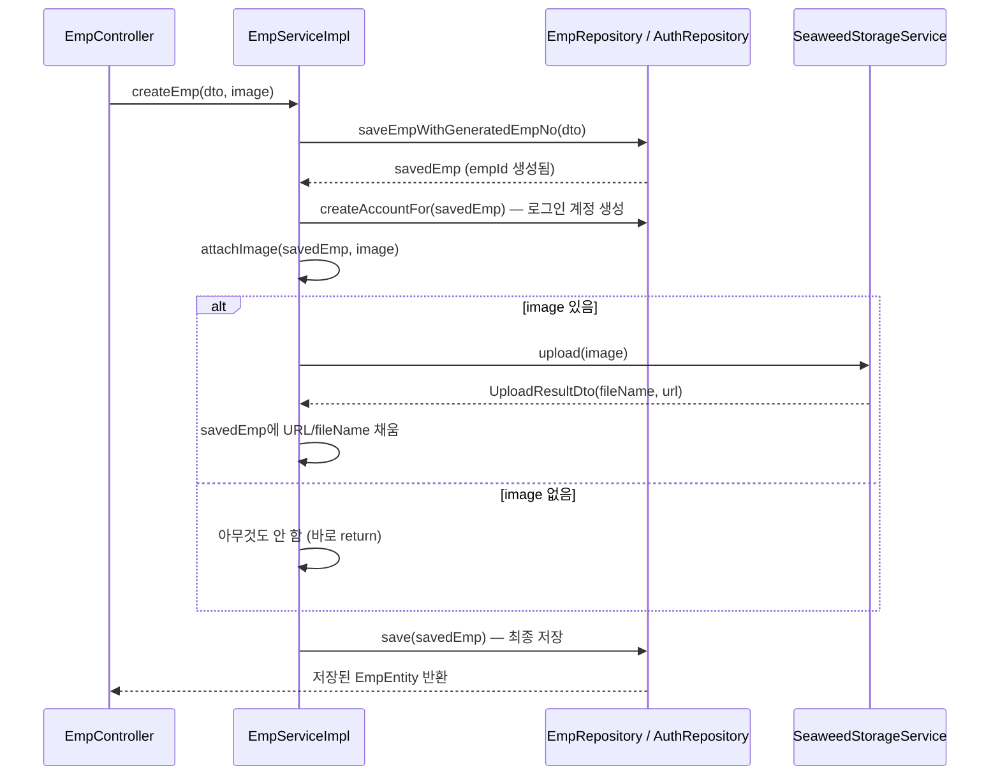

# EmpServiceImpl 코드 설명

파일 위치: `src/main/java/kr/co/seoulit/his/adminservice/emp/service/impl/EmpServiceImpl.java`

직원(EMPLOYEE) 등록/수정/조회를 담당하는 서비스. 오늘 작업으로 여기에 SeaweedFS 이미지 업로드 연동이 추가됨.

---

## 전체 흐름 (등록 + 이미지)



---

## 클래스 선언부 및 필드

```java
@Slf4j
@Service
@RequiredArgsConstructor
@Transactional
public class EmpServiceImpl implements EmpService {

    private final EmpMapper empMapper;
    private final EmpRepository empRepository;
    private final AuthRepository authRepository;
    private final SeaweedStorageService seaweedStorageService;
```

- `@Slf4j`: Lombok이 `log`라는 이름의 로거 필드를 자동으로 만들어줌. 직접 `Logger log = LoggerFactory.getLogger(...)`를 안 써도 `log.warn(...)`처럼 바로 쓸 수 있음. 오늘 이미지 업로드 실패를 기록하려고 추가함.
- `@Transactional`(클래스 레벨): 이 클래스의 모든 public 메서드는 기본적으로 하나의 DB 트랜잭션 안에서 실행됨.
- `seaweedStorageService`: 오늘 새로 추가된 필드. `storage.seaweed` 패키지의 인터페이스를 그대로 주입받음 — 이 클래스는 SeaweedFS를 어떻게 호출하는지 전혀 몰라도 되고 `upload()`/`delete()`만 부르면 됨.

---

## createEmp() — 등록

```java
@Override
public EmpEntity createEmp(EmpDto dto, MultipartFile image) {
    EmpEntity savedEmp = saveEmpWithGeneratedEmpNo(dto);
    createAccountFor(savedEmp);
    attachImage(savedEmp, image);
    return empRepository.save(savedEmp);
}
```

4단계:
1. **`saveEmpWithGeneratedEmpNo(dto)`**: 사번을 자동 채번해서 직원을 먼저 저장 (아래 별도 설명). 이 시점에 `empId`(UUID)가 생성됨.
2. **`createAccountFor(savedEmp)`**: 로그인 계정(ACCOUNT)을 같이 만듦.
3. **`attachImage(savedEmp, image)`**: 이미지가 있으면 업로드해서 `savedEmp`에 URL을 채움 (아래 별도 설명). *SeaweedFS 파일명이 UUID라 `empId`에 의존하지 않기 때문에, 이 단계를 1번보다 먼저 해도 상관없지만 — 순서를 지금처럼 두면 "직원 저장 자체는 이미지와 무관하게 항상 되어야 한다"는 의도가 코드 순서로도 드러나서 이 순서를 유지함.*
4. **`empRepository.save(savedEmp)`**: `attachImage`에서 바뀐 필드(`profileImageUrl` 등)까지 포함해서 최종 저장.

### saveEmpWithGeneratedEmpNo() — 사번 채번 재시도 로직 (기존 코드, 참고용)

```java
private EmpEntity saveEmpWithGeneratedEmpNo(EmpDto dto) {
    DataIntegrityViolationException lastError = null;
    for (int attempt = 1; attempt <= EMP_NO_MAX_RETRY; attempt++) {
        EmpEntity empEntity = empMapper.toEmpEntity(dto);
        empEntity.setEmpNo(generateNextEmpNo());
        try {
            return empRepository.saveAndFlush(empEntity);
        } catch (DataIntegrityViolationException e) {
            lastError = e;
        }
    }
    throw lastError;
}
```

사번(`EMP_NO`)은 `E202608001`처럼 "이번 달 + 순번" 조합의 UNIQUE 값. 동시에 두 명을 등록하면 같은 순번을 계산해서 충돌(`DataIntegrityViolationException`)이 날 수 있어서, 최대 5번까지 "다음 순번 다시 계산 → 재시도"하는 구조. `saveAndFlush`를 쓰는 이유는 `save()`만으로는 실제 INSERT가 지연될 수 있어서 — 지금 당장 DB에 반영해서 UNIQUE 제약 위반을 여기서 바로 잡아내야 재시도 로직이 의미가 있음.

---

## updateEmp() — 수정

```java
@Override
public EmpEntity updateEmp(String empId, EmpDto dto, MultipartFile image) {
    EmpEntity empEntity = empRepository.findById(empId)
            .orElseThrow(() -> new BusinessException(ErrorCode.EMP_NOT_FOUND));
    empEntity.setEmpName(dto.getEmpName());
    empEntity.setEmpEmail(dto.getEmpEmail());
    empEntity.setEmpPhone(dto.getEmpPhone());
    empEntity.setRetireDate(dto.getRetireDate());
    empEntity.setEmpStatus(dto.getEmpStatus());
    empEntity.setDeptCode(dto.getDeptCode());
    attachImage(empEntity, image);
    return empRepository.save(empEntity);
}
```

기존 필드 업데이트 로직은 그대로고, `attachImage()` 호출이 추가됨. `createEmp`와 똑같은 `attachImage` 메서드를 재사용 — 등록/수정에서 이미지 처리 로직을 중복해서 짤 필요가 없음.

---

## attachImage() — 오늘의 핵심 추가 로직

```java
private void attachImage(EmpEntity empEntity, MultipartFile image) {
    if (image == null || image.isEmpty()) {
        return;
    }
    try {
        if (empEntity.getProfileImageUrl() != null) {
            seaweedStorageService.delete(empEntity.getProfileImageUrl());
        }
        UploadResultDto result = seaweedStorageService.upload(image);
        empEntity.setProfileImageUrl(result.getUrl());
        empEntity.setProfileImageFid(result.getFileName());
    } catch (Exception e) {
        log.warn("직원({}) 이미지 업로드 실패, 직원 정보 저장은 계속 진행", empEntity.getEmpId(), e);
    }
}
```

한 줄씩:

```java
if (image == null || image.isEmpty()) {
    return;
}
```
이미지를 아예 안 보냈거나(`null`, 등록 시 사진 생략 가능), 빈 파일이면 아무것도 안 하고 바로 끝. **가장 흔한 경우(사진 안 바꿈)를 제일 먼저 걸러내는 가드절(guard clause)** 패턴.

```java
if (empEntity.getProfileImageUrl() != null) {
    seaweedStorageService.delete(empEntity.getProfileImageUrl());
}
```
이미 사진이 있던 직원이면(수정 케이스), 새 사진을 올리기 **전에** 기존 사진을 SeaweedFS에서 지움. 이걸 안 하면 교체할 때마다 예전 파일이 SeaweedFS에 계속 쌓여서 안 쓰는 파일이 늘어남. (등록 케이스는 애초에 `profileImageUrl`이 `null`이라 이 블록이 그냥 스킵됨.)

```java
UploadResultDto result = seaweedStorageService.upload(image);
empEntity.setProfileImageUrl(result.getUrl());
empEntity.setProfileImageFid(result.getFileName());
```
새 이미지를 업로드하고, 돌아온 결과(URL, 파일명)를 엔티티 필드에 채움. 이 시점엔 아직 DB에 저장된 게 아니라 **메모리 상의 엔티티 객체만 바뀐 상태** — 실제 DB 반영은 `createEmp`/`updateEmp`가 마지막에 부르는 `empRepository.save(...)`에서 일어남.

```java
} catch (Exception e) {
    log.warn("직원({}) 이미지 업로드 실패, 직원 정보 저장은 계속 진행", empEntity.getEmpId(), e);
}
```
**이 메서드의 설계 핵심**: `upload()`나 `delete()`에서 어떤 예외가 나든(SeaweedFS 서버가 꺼져있다거나, 네트워크 문제 등) 여기서 잡아서 로그만 남기고 **메서드를 정상 종료**시켜요. 예외를 다시 던지지 않기 때문에, 이 메서드를 호출한 `createEmp`/`updateEmp`는 이미지 실패 여부와 무관하게 항상 끝까지 실행되고 직원 정보 저장은 성공해요.

→ 이게 이전에 얘기했던 **"이미지 업로드 실패해도 직원 저장 자체는 성공 처리"(A안)** 의 실제 구현이에요. SeaweedFS가 통째로 죽어도 직원 등록/수정 자체는 막히지 않도록요.

---

## 아직 안 한 것 (다음 단계 후보)

- FE: 등록/수정 폼에 파일 입력 추가, 요청을 JSON → `FormData`로 전환
- 파일 타입 검증(`image/jpeg`, `image/png`만 허용 등) — 지금은 아무 파일이나 업로드 가능
- 사진 조회(다운로드) 프록시 엔드포인트 — 지금은 없음, FE가 `profileImageUrl`을 그대로 ``에 써야 함 (SeaweedFS 주소가 그대로 노출된다는 뜻이라, 나중에 다시 검토 필요)
- `RuntimeException`(SeaweedStorageServiceImpl 안) → 프로젝트 컨벤션인 `BusinessException`/`ErrorCode`로 교체
