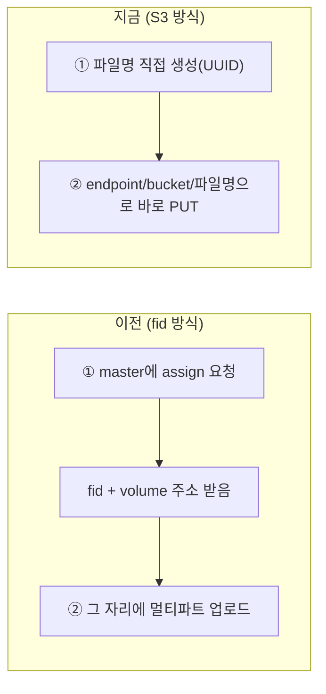

# SeaweedStorageServiceImpl 코드 설명 (S3 API 방식)

파일 위치: `src/main/java/kr/co/seoulit/his/adminservice/storage/seaweed/service/impl/SeaweedStorageServiceImpl.java`

`SeaweedStorageService` 인터페이스(`upload`/`delete`)의 실제 구현체. SeaweedFS의 **S3 호환 API**로 통신한다. (처음엔 fid 방식으로 설계했다가, 다른 참고 프로젝트(`HisBack`의 `EmpPhotoServiceImpl`)와 비교해보고 더 단순한 S3 방식으로 전환함.)

**확정된 로컬 설정**
- S3 API 엔드포인트: `http://localhost:8333`
- 버킷: `emp-photo`
- (Master 9333 / Volume 8081 / Filer 8888도 같이 떠 있어야 S3 게이트웨이가 동작함 — `weed server -s3` 로 all-in-one 기동)

---

## fid 방식과 뭐가 다른가



- 통신이 2번(assign + upload) → 1번(PUT)으로 줄어듦
- `fid`라는 SeaweedFS 전용 식별자가 없어짐 — 대신 우리가 정한 `fileName`이 곧 식별자
- 멀티파트 조립(`ByteArrayResource` 익명 클래스, `MultiValueMap`)이 필요 없어짐 — S3 PUT은 파일 바이트를 요청 본문에 그대로 실음

---

## 전체 코드

```java
package kr.co.seoulit.his.adminservice.storage.seaweed.service.impl;

import kr.co.seoulit.his.adminservice.storage.seaweed.config.SeaweedProperties;
import kr.co.seoulit.his.adminservice.storage.seaweed.dto.UploadResultDto;
import kr.co.seoulit.his.adminservice.storage.seaweed.service.SeaweedStorageService;
import lombok.RequiredArgsConstructor;
import org.springframework.http.HttpEntity;
import org.springframework.http.HttpHeaders;
import org.springframework.http.MediaType;
import org.springframework.stereotype.Component;
import org.springframework.web.client.RestTemplate;
import org.springframework.web.multipart.MultipartFile;

import java.io.IOException;
import java.util.UUID;

@Component
@RequiredArgsConstructor
public class SeaweedStorageServiceImpl implements SeaweedStorageService {

    private final SeaweedProperties seaweedProperties;
    private final RestTemplate restTemplate = new RestTemplate();

    @Override
    public UploadResultDto upload(MultipartFile file) {
        String fileName = UUID.randomUUID() + getExtension(file.getOriginalFilename());
        String url = seaweedProperties.getEndpoint() + "/" + seaweedProperties.getBucket() + "/" + fileName;

        HttpHeaders headers = new HttpHeaders();
        MediaType contentType = file.getContentType() != null
                ? MediaType.parseMediaType(file.getContentType())
                : MediaType.APPLICATION_OCTET_STREAM;
        headers.setContentType(contentType);

        try {
            restTemplate.put(url, new HttpEntity<>(file.getBytes(), headers));
        } catch (IOException e) {
            throw new RuntimeException("이미지 파일을 읽는 중 오류가 발생했습니다.", e);
        }

        return new UploadResultDto(fileName, url);
    }

    @Override
    public void delete(String fileUrl) {
        restTemplate.delete(fileUrl);
    }

    private String getExtension(String originalFileName) {
        if (originalFileName == null || !originalFileName.contains(".")) {
            return "";
        }
        return originalFileName.substring(originalFileName.lastIndexOf("."));
    }
}
```

---

## 단계별 설명

### `upload()` — ① 파일명 직접 생성

```java
String fileName = UUID.randomUUID() + getExtension(file.getOriginalFilename());
```

`UUID.randomUUID()`로 겹칠 일 없는 고유 이름을 만들고, 원본 확장자(`.jpg` 등)를 뒤에 붙인다. 확장자를 안 붙이면 나중에 브라우저가 이 파일이 뭔지 힌트를 못 얻는다.

### ② 주소 조합

```java
String url = seaweedProperties.getEndpoint() + "/" + seaweedProperties.getBucket() + "/" + fileName;
```

S3 방식 주소는 `endpoint/bucket/파일명` 조합. 예: `http://localhost:8333/emp-photo/3f2a...-abcd.jpg`. 서버가 알려주는 값을 기다릴 필요 없이, 이미 알고 있는 값 3개(endpoint, bucket, fileName)로 문자열 조합만 하면 완성된다.

### ③ Content-Type 지정

```java
HttpHeaders headers = new HttpHeaders();
MediaType contentType = file.getContentType() != null
        ? MediaType.parseMediaType(file.getContentType())
        : MediaType.APPLICATION_OCTET_STREAM;
headers.setContentType(contentType);
```

업로드된 파일의 실제 타입(`image/jpeg` 등)을 그대로 Content-Type 헤더에 넣는다. 이걸 안 하면 나중에 이 URL을 브라우저 `` 태그에 넣었을 때 이미지로 안 뜨고 다운로드되거나 깨질 수 있다. 타입 정보가 없으면(`null`) 기본값(`APPLICATION_OCTET_STREAM`, "그냥 바이너리 데이터"라는 뜻)을 대신 쓴다.

### ④ 실제 전송

```java
restTemplate.put(url, new HttpEntity<>(file.getBytes(), headers));
```

`RestTemplate.put(주소, 요청내용)` — `HttpEntity`로 헤더+바디(파일 바이트)를 하나로 묶어서 그 주소에 PUT. S3 스펙에서 "이 경로에 이 파일을 저장해라"는 PUT 한 번으로 끝난다.

### ⑤ 결과 반환

```java
return new UploadResultDto(fileName, url);
```

둘 다 이미 알고 있는 값이라 그대로 담아서 반환.

### `delete()`

```java
@Override
public void delete(String fileUrl) {
    restTemplate.delete(fileUrl);
}
```

S3도 삭제는 그 주소로 DELETE 한 번이면 끝. fid 방식과 동일해서 코드 변경 없음.

### `getExtension()` (private 헬퍼)

`"photo.jpg"` → `.contains(".")`로 점이 있는지 확인 → `lastIndexOf(".")`(마지막 점 위치)부터 끝까지 잘라서 `".jpg"`만 추출. 점이 아예 없으면 빈 문자열을 돌려줘서 에러를 방지한다.

---

## 로컬 SeaweedFS 확인 이력

```bash
# S3 게이트웨이 포함 all-in-one 기동
weed.exe server -dir="C:\dev\seaweedfs_data" -volume.port=8081 -s3 -s3.port=8333 -master.port=9333 -filer.port=8888

# 버킷 생성
curl -X PUT http://localhost:8333/emp-photo

# 업로드/조회/삭제 실제 확인 완료 (PUT 200, GET 200, DELETE 204 → 이후 GET 404 NoSuchKey)
```

## 아직 안 한 것 (다음 단계 후보)

- 파일 타입 검증 (`image/jpeg`, `image/png` 등만 허용) — `HisBack`의 `EmpPhotoServiceImpl` 참고
- 교체 시 기존 사진 자동 삭제 로직 — `EmpServiceImpl`에서 처리 예정
- 다운로드(조회) 프록시 엔드포인트 — 아직 없음
- `RuntimeException` → 프로젝트 컨벤션인 `BusinessException`/`ErrorCode`로 교체
- `EmpServiceImpl`/`EmpController`에서 이 서비스 실제로 연결하기
